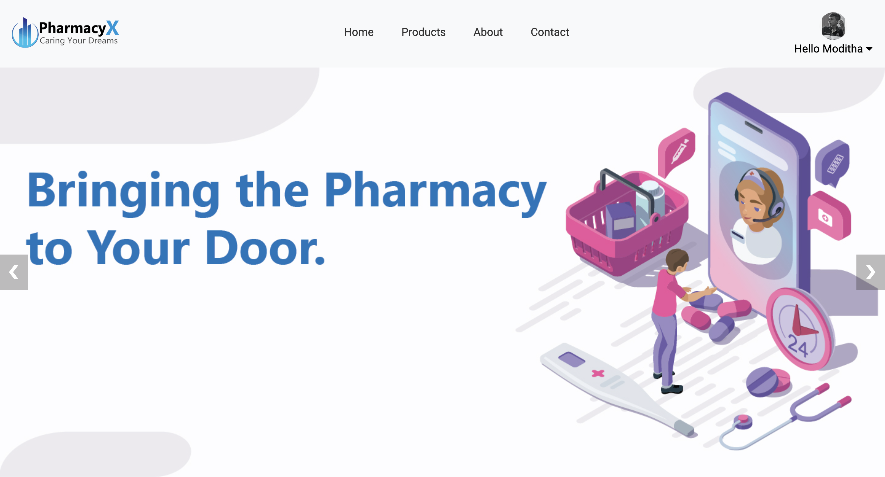
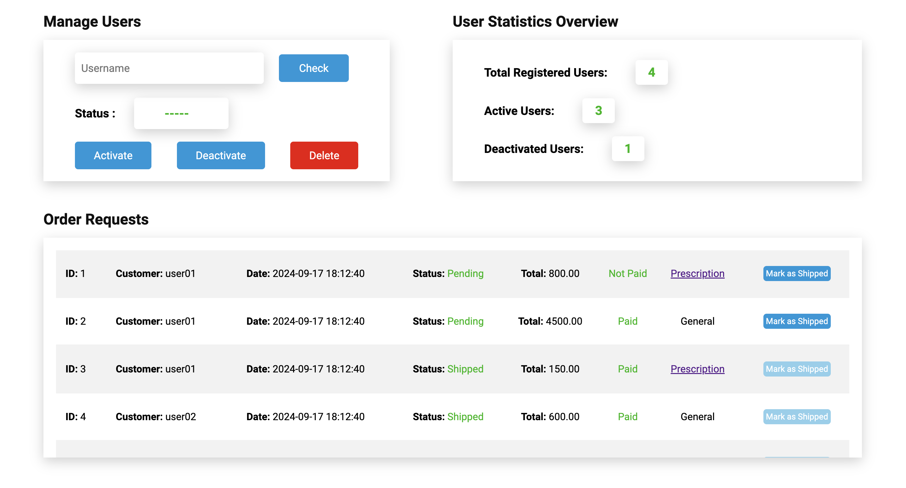
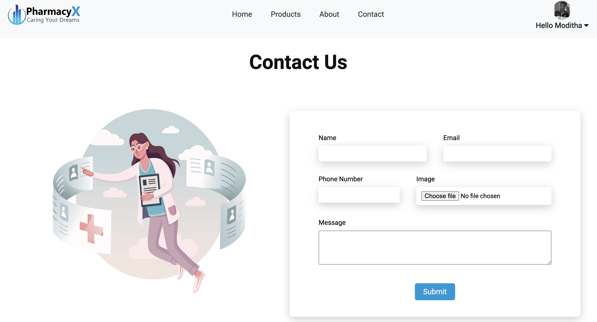

<h1 align="center" id="title">Online Pharmacy Portal</h1>

<div align="center">


<br>Homepage<br><br>

<hr>


<br>Products Page<br><br>

<hr>


<br>Admin Dashboard<br><br>

<hr>


<br>Contact Us page<br><br>

<hr>

</div>

# About the Project

The **Online Pharmacy Portal** is a web-based pharmacy management and online medicine ordering system developed using **PHP, MySQL, HTML, CSS, and JavaScript**.

The main purpose of the project is to provide an online platform where customers can browse medicines and pharmacy products, add products to their shopping cart, place orders, make payments, upload prescriptions, and track their orders.

The system provides separate dashboards and functionalities for **Administrators, Managers, Pharmacists, and Customers**.

The project also includes database management using MySQL and automated browser testing using **Selenium WebDriver with Python and PyTest**.

## Project Objectives

- Provide an easy-to-use online pharmacy platform.
- Allow customers to browse and purchase pharmacy products online.
- Manage customer accounts and authentication.
- Manage products, orders, payments, and prescriptions.
- Provide separate access for different user roles.
- Maintain pharmacy data using a MySQL database.
- Reduce manual work involved in pharmacy order management.
- Provide automated testing for important application workflows.
- Maintain the project using Git and GitHub.

# Main Modules

## 1. Customer Module

The customer module allows users to access the online pharmacy and perform shopping-related activities.

### Customer Features

- Customer registration
- Customer login and logout
- Browse products
- View product details
- Add products to cart
- Update cart quantities
- Remove products from cart
- Place orders
- Make payments
- View order history
- Track orders
- Cancel orders
- Download invoices
- Upload prescriptions
- Manage customer profile
- Contact the pharmacy

## 2. Admin Module

The Admin module provides administrative functionality for managing the pharmacy system.

### Admin Features

- Admin authentication
- Admin dashboard
- Manage system users
- Manage pharmacy information
- View and manage orders
- Monitor system activities
- Manage application data

## 3. Manager Module

The Manager module provides management-level access to pharmacy operations.

### Manager Features

- Manager authentication
- Manager dashboard
- Manage products
- Manage orders
- Monitor pharmacy operations
- Manage relevant pharmacy data

## 4. Pharmacist Module

The Pharmacist module is designed for handling pharmacy-related operations.

### Pharmacist Features

- Pharmacist authentication
- Pharmacist dashboard
- Handle customer orders
- Process prescriptions
- Manage pharmacy orders
- Assist in processing customer requirements

# Customer Order Flow

The general customer workflow of the application is:

```text
Customer Registration/Login
          ↓
      Browse Products
          ↓
    View Product Details
          ↓
       Add to Cart
          ↓
      Update Cart
          ↓
      Place Order
          ↓
        Payment
          ↓
    Order Confirmation
          ↓
      Track Order
          ↓
    Download Invoice
```

For prescription-based orders:

```text
Customer Login
      ↓
Upload Prescription
      ↓
Prescription Processing
      ↓
Order Processing
      ↓
Payment
      ↓
Order Tracking
```

# Technologies Used

| Technology | Purpose |
|---|---|
| HTML | Web page structure |
| CSS | Website styling and layout |
| JavaScript | Client-side functionality |
| PHP | Backend/server-side development |
| MySQL | Database management |
| XAMPP | Local Apache and MySQL server |
| Python | Selenium test automation |
| Selenium WebDriver | Browser automation |
| PyTest | Test execution and reporting |
| Page Object Model | Selenium test organization |
| Git | Version control |
| GitHub | Source code hosting |

# Database

The project uses **MySQL** as the database management system.

The database name used by the project is:

```text
pharmacyx_db
```

The database SQL file is available in:

```text
Database/PharmacyX_DB.sql
```

## Main Database Tables

The database contains tables for different parts of the pharmacy system:

- `user_info` – stores user account information
- `products` – stores pharmacy product information
- `cart` – stores customer cart information
- `orders` – stores customer order information
- `payment` – stores payment information
- `prescriptions` – stores prescription-related information
- `messages` – stores customer/contact messages

# Project Structure

```text
onlinepharmacy/
│
├── Database/
│   ├── PharmacyX_DB.sql
│   └── db.txt
│
├── db_Config/
│   └── config.php
│
├── Images/
│   ├── Product Images/
│   ├── Profile Pictures/
│   └── Pharmacy X Icon.png
│
├── CSS/
│
├── JS/
│
├── Preview/
│   ├── homepage.png
│   ├── products.png
│   ├── admin-dashboard.png
│   ├── contact.png
│   ├── Screenshot 2024-10-10 at 1.03.26 PM.png
│   └── Screenshot 2024-10-10 at 1.03.42 PM.png
│
├── tests/
│   └── selenium/
│       ├── pages/
│       │   ├── cart_page.py
│       │   ├── order_page.py
│       │   ├── payment_page.py
│       │   ├── products_page.py
│       │   └── signin_page.py
│       │
│       ├── conftest.py
│       ├── test_cart.py
│       ├── test_home.py
│       ├── test_order.py
│       ├── test_payment.py
│       ├── test_products.py
│       └── test_signin.py
│
├── reports/
│   └── final_selenium_report.html
│
├── uploads/
│
├── .gitignore
├── README.md
│
├── index.php
├── login.php
├── logout.php
├── signin.php
├── register.php
│
├── my_account.php
├── profile.php
├── contact.php
├── privacyPolicy.php
├── t&c.php
│
├── products.php
├── product_details.php
├── order_product.php
│
├── cart.php
├── add_to_cart.php
├── remove_from_cart.php
├── update_cart.php
├── plus.php
├── minus.php
│
├── paymentpage.php
├── my_orders.php
├── track_order.php
├── cancel_order.php
├── invoice.php
├── download_invoice.php
│
├── prescription.php
├── prescription_upload.php
├── upload_prescription.php
├── update_prescription.php
├── view_prescriptions.php
├── prescription_status.php
│
├── admin_login.php
├── admin_DB.php
├── admin_orders.php
├── manage_users.php
│
├── manager_login.php
├── manager_DB.php
├── manage_orders.php
├── update_order.php
├── update_order_status.php
├── view_orders.php
├── reject_order.php
│
├── pharmacist_login.php
├── pharmacist_DB.php
├── pharmacist_dashboard.php
├── pharmacist_medicines.php
├── pharmacist_prescriptions.php
│
└── Other PHP application files
```

# Project Structure Description

| File / Folder | Description |
|---|---|
| `Database/` | Contains database-related files |
| `Database/PharmacyX_DB.sql` | SQL file containing the MySQL database structure and data |
| `Database/db.txt` | Contains database-related information |
| `db_Config/` | Contains database configuration files |
| `db_Config/config.php` | Establishes the PHP–MySQL database connection |
| `Images/` | Stores images used throughout the application |
| `Images/Product Images/` | Contains pharmacy product images |
| `Images/Profile Pictures/` | Contains user profile images |
| `CSS/` | Contains CSS files for website styling |
| `JS/` | Contains JavaScript files for client-side functionality |
| `Preview/` | Contains screenshots used to demonstrate the application |
| `uploads/` | Directory used for application file uploads |
| `tests/selenium/` | Contains automated Selenium test cases |
| `tests/selenium/pages/` | Contains Page Object Model classes for different application pages |
| `tests/selenium/conftest.py` | Contains common PyTest fixtures and Selenium configuration |
| `test_home.py` | Tests homepage functionality |
| `test_signin.py` | Tests sign-in and authentication functionality |
| `test_products.py` | Tests product functionality |
| `test_cart.py` | Tests shopping cart functionality |
| `test_order.py` | Tests order functionality |
| `test_payment.py` | Tests payment functionality |
| `reports/` | Contains Selenium test reports |
| `reports/final_selenium_report.html` | Final Selenium HTML test report |
| `index.php` | Main homepage of the Online Pharmacy Portal |
| `login.php` | Customer login page |
| `signin.php` | Customer sign-in functionality |
| `register.php` | Handles customer registration |
| `logout.php` | Handles user logout |
| `my_account.php` | Provides customer account functionality |
| `profile.php` | Allows customers to manage their profile |
| `contact.php` | Provides the Contact Us functionality |
| `privacyPolicy.php` | Displays the privacy policy |
| `t&c.php` | Displays the terms and conditions |
| `products.php` | Displays available pharmacy products |
| `product_details.php` | Displays detailed information about a product |
| `order_product.php` | Handles product ordering functionality |
| `cart.php` | Displays and manages the customer's shopping cart |
| `add_to_cart.php` | Adds products to the shopping cart |
| `remove_from_cart.php` | Removes products from the shopping cart |
| `update_cart.php` | Updates shopping cart information |
| `plus.php` | Handles increasing cart quantity |
| `minus.php` | Handles decreasing cart quantity |
| `paymentpage.php` | Provides the payment interface |
| `my_orders.php` | Displays customer orders |
| `track_order.php` | Provides order tracking |
| `cancel_order.php` | Handles order cancellation |
| `invoice.php` | Displays order invoice |
| `download_invoice.php` | Provides invoice downloading |
| `prescription.php` | Provides prescription-related functionality |
| `prescription_upload.php` | Handles prescription upload functionality |
| `upload_prescription.php` | Processes uploaded prescriptions |
| `update_prescription.php` | Updates prescription information |
| `view_prescriptions.php` | Displays prescription information |
| `prescription_status.php` | Handles prescription status |
| `admin_login.php` | Provides administrator authentication |
| `admin_DB.php` | Handles administrator-related database operations |
| `admin_orders.php` | Provides administrator order management |
| `manage_users.php` | Provides user management functionality |
| `manager_login.php` | Provides manager authentication |
| `manager_DB.php` | Handles manager-related database operations |
| `manage_orders.php` | Provides order management functionality |
| `update_order.php` | Updates order information |
| `update_order_status.php` | Updates order status |
| `view_orders.php` | Displays orders for management |
| `reject_order.php` | Handles order rejection |
| `pharmacist_login.php` | Provides pharmacist authentication |
| `pharmacist_DB.php` | Handles pharmacist-related database operations |
| `pharmacist_dashboard.php` | Pharmacist dashboard |
| `pharmacist_medicines.php` | Provides pharmacist medicine management |
| `pharmacist_prescriptions.php` | Provides pharmacist prescription management |
| `.gitignore` | Specifies files and folders that should not be committed to Git |
| `README.md` | Main project documentation |

# Authentication and User Roles

The application provides role-based access for different users.

```text
                    Online Pharmacy Portal
                            │
          ┌─────────────────┼─────────────────┐
          │                 │                 │
       Customer           Manager          Staff
          │                 │          ┌──────┴──────┐
          │                 │          │             │
       Shopping          Management  Admin       Pharmacist
       & Orders
```

Each role has its own authentication and application functionality.

## User Logins

### Admin

```text
Username: admin01
Password: Use the configured project credentials
```

### Managers

```text
Username: manager01
Password: Use the configured project credentials

Username: manager02
Password: Use the configured project credentials
```

### Customer

```text
Username: archi
Password: Use the configured project credentials
```

> **Security Note:** Actual passwords are intentionally not stored in this README because this is a public GitHub repository. Credentials should be configured securely through the appropriate local/environment configuration.

# Selenium Automation Testing

The project includes automated browser testing using:

- Python
- Selenium WebDriver
- PyTest
- Page Object Model (POM)
- PyTest HTML reporting

The Selenium tests are organized into separate test modules according to application functionality.

## Selenium Test Structure

```text
tests/
└── selenium/
    │
    ├── pages/
    │   ├── cart_page.py
    │   ├── order_page.py
    │   ├── payment_page.py
    │   ├── products_page.py
    │   └── signin_page.py
    │
    ├── conftest.py
    ├── test_cart.py
    ├── test_home.py
    ├── test_order.py
    ├── test_payment.py
    ├── test_products.py
    └── test_signin.py
```

## Selenium Test Coverage

The automated tests cover:

- Homepage functionality
- User authentication
- Invalid login handling
- Empty login validation
- Logout functionality
- Session protection
- Product functionality
- Shopping cart functionality
- Order functionality
- Payment functionality
- Important customer workflows

# Final Selenium Test Result

The final Selenium test execution successfully completed with:

```text
Total Tests : 35
Passed      : 35
Failed      : 0
Skipped     : 0
Errors      : 0
Pass Rate   : 100%
```

### Test Result

**35/35 Selenium tests passed successfully.**

The final HTML report is available at:

```text
reports/final_selenium_report.html
```

# Running the Project Locally

## Step 1: Install XAMPP

Install XAMPP with:

- Apache
- MySQL

## Step 2: Place the Project

Copy the project into:

```text
C:\xampp\htdocs\onlinepharmacy
```

## Step 3: Start XAMPP

Start:

```text
Apache
MySQL
```

from the XAMPP Control Panel.

## Step 4: Create the Database

Open phpMyAdmin and create:

```text
pharmacyx_db
```

Import the SQL file:

```text
Database/PharmacyX_DB.sql
```

## Step 5: Configure Database Connection

Open:

```text
db_Config/config.php
```

Configure the database connection according to the local MySQL setup.

## Step 6: Open the Application

Open the following URL:

```text
http://localhost/onlinepharmacy/
```

# Running Selenium Tests

Install the required Python packages:

```bash
pip install pytest selenium pytest-html python-dotenv
```

Run the complete Selenium test suite:

```bash
pytest tests\selenium -v
```

Generate the HTML report:

```bash
pytest tests\selenium -v --html=reports/final_selenium_report.html --self-contained-html
```

The generated report will be available at:

```text
reports/final_selenium_report.html
```

# GitHub and Version Control

The project is maintained using **Git** for version control and **GitHub** for source-code hosting.

The repository contains:

- PHP application source code
- Frontend files
- Database SQL file
- Selenium automation tests
- Selenium HTML test report
- Project documentation

Sensitive and temporary files are excluded using `.gitignore`.

# Security

The project uses `.gitignore` to prevent sensitive or unnecessary files from being committed.

Examples include:

```text
.env
venv/
.pytest_cache/
uploads/
.vscode/
.DS_Store
project.zip
```

Sensitive credentials should not be committed to a public repository.

# Project Status

The **Online Pharmacy Portal** has been implemented with customer, administration, management, and pharmacist functionality.

The project also includes automated Selenium testing.

```text
Application Status : Completed
Selenium Tests     : 35/35 Passed
Failed Tests       : 0
Pass Rate          : 100%
```

# Future Enhancements

Possible future improvements include:

- Online deployment and cloud hosting
- Improved payment gateway integration
- Email/SMS order notifications
- Advanced product search and filtering
- Improved inventory management
- Enhanced reporting and analytics
- Responsive design improvements
- Additional automated test coverage

# Contributors

[**Moditha Marasingha**](https://github.com/ModithaM) | 
[**Hasindu Chanuka**](https://github.com/hasindu1998) | 
[**Kulanya Lisaldi**](https://github.com/KulanyaLisaldi) | 
[**Deshan**](https://github.com/Deshan-z) | 
[**Medhani**](https://github.com/PabodaWA)